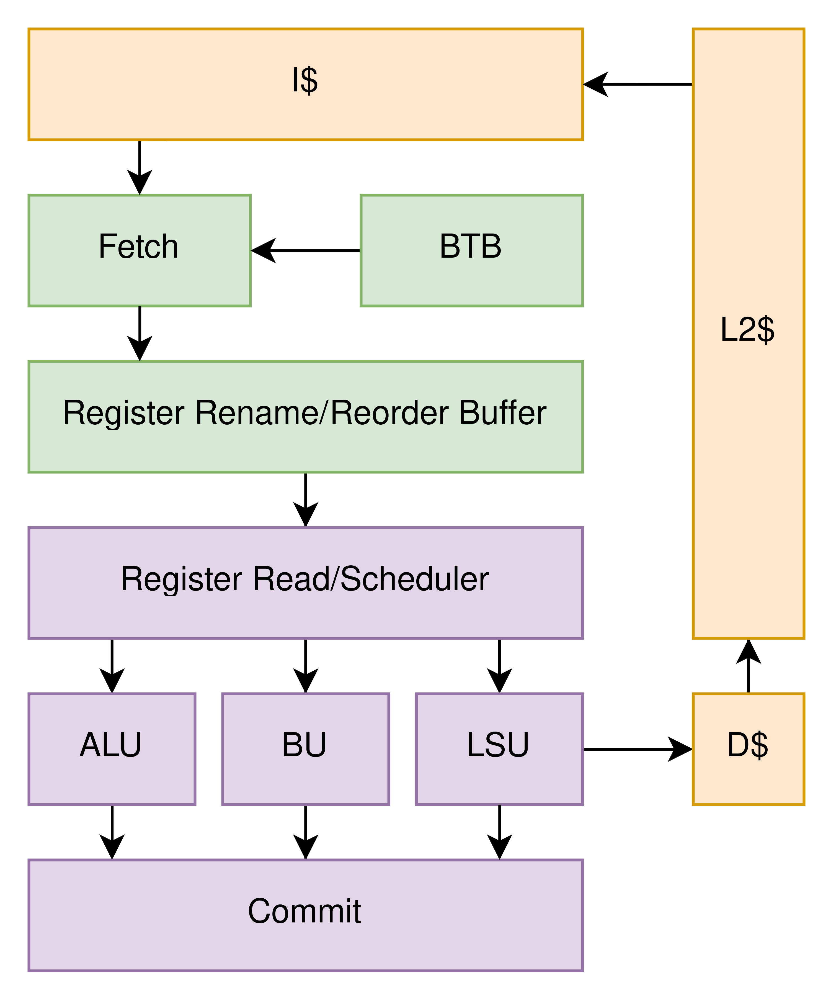
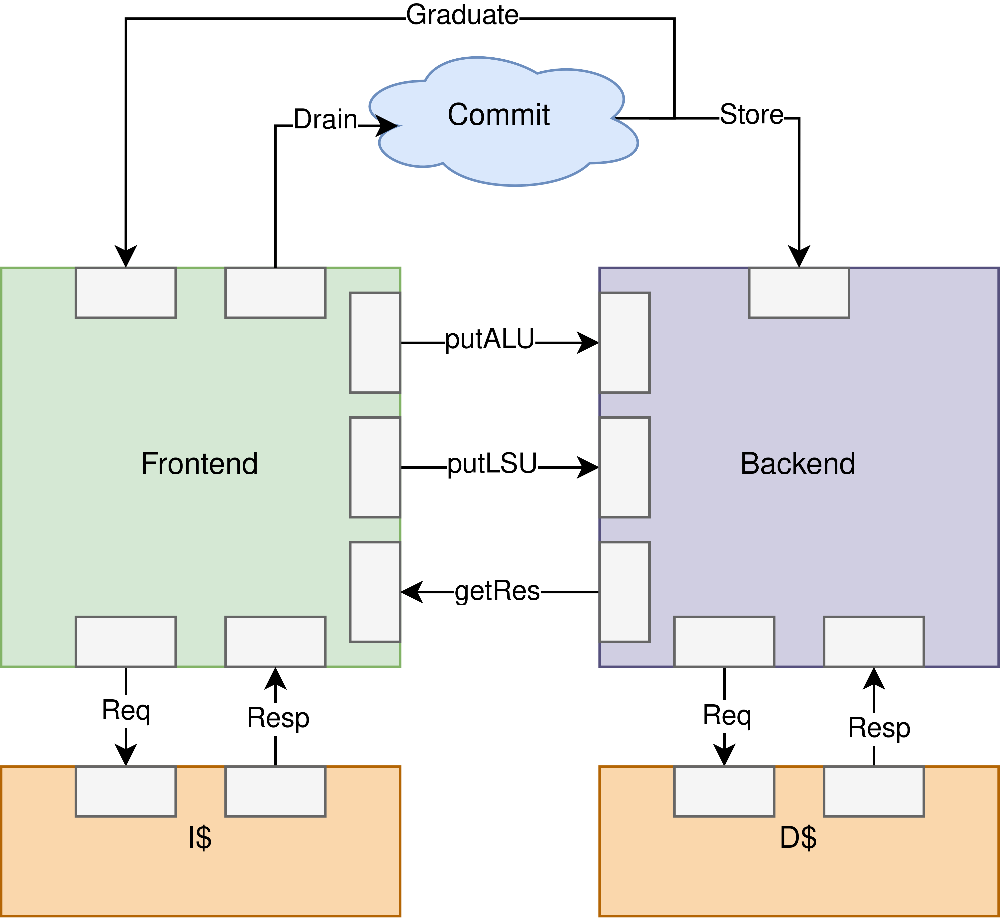
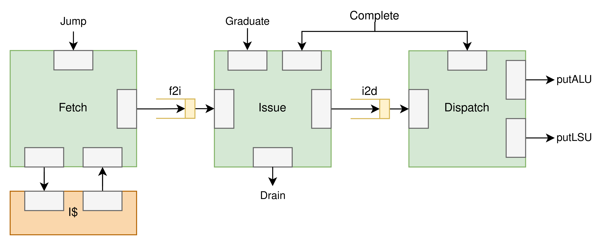
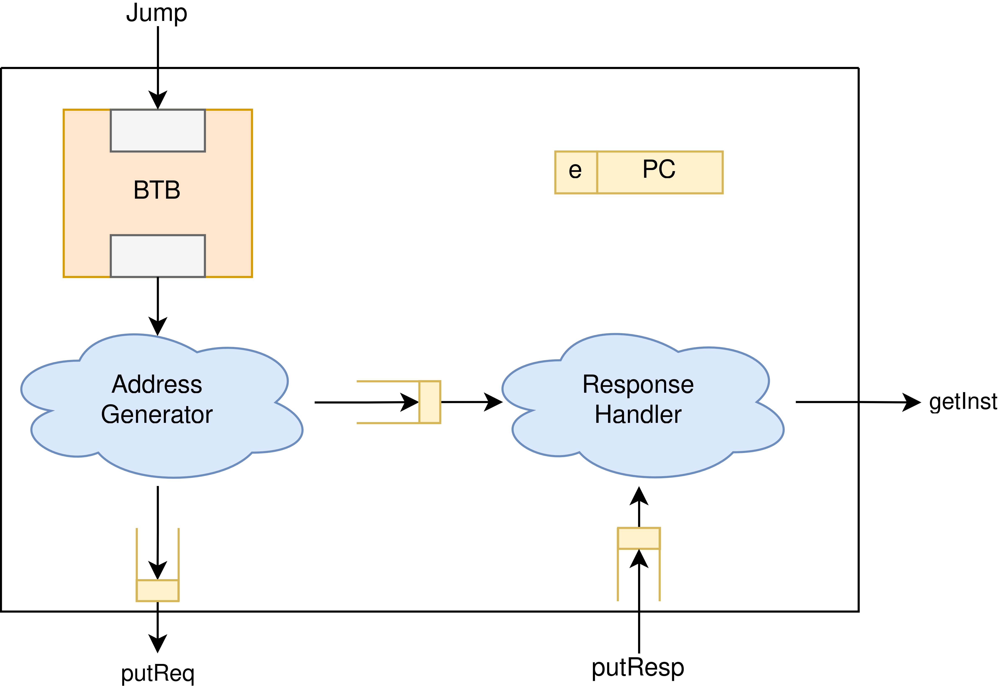
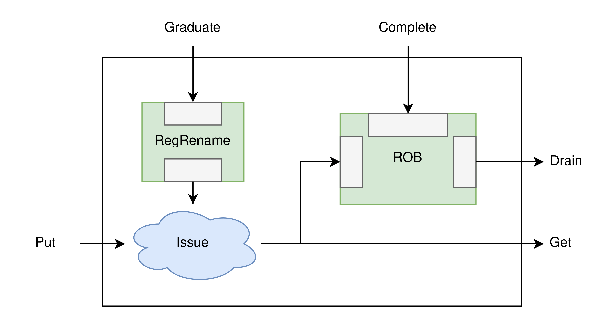
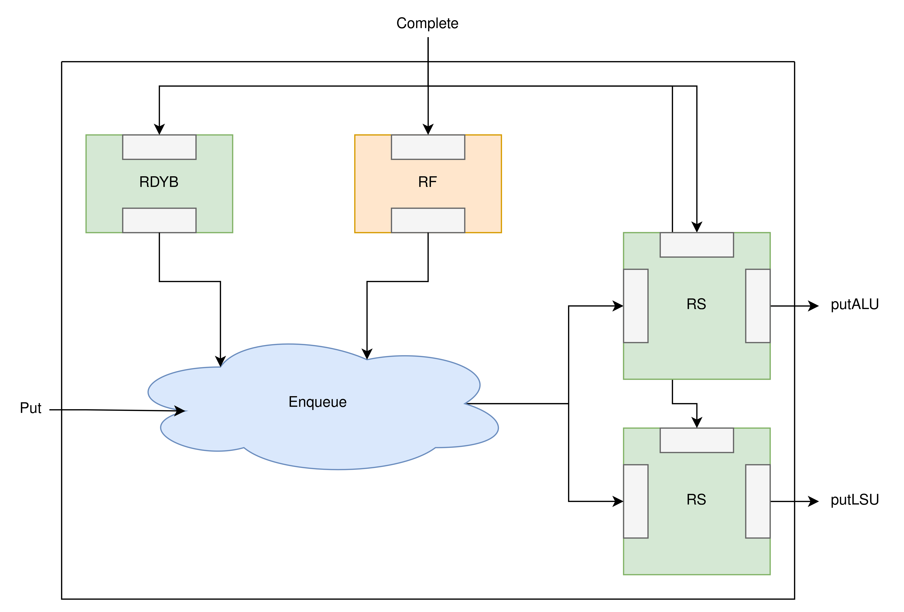
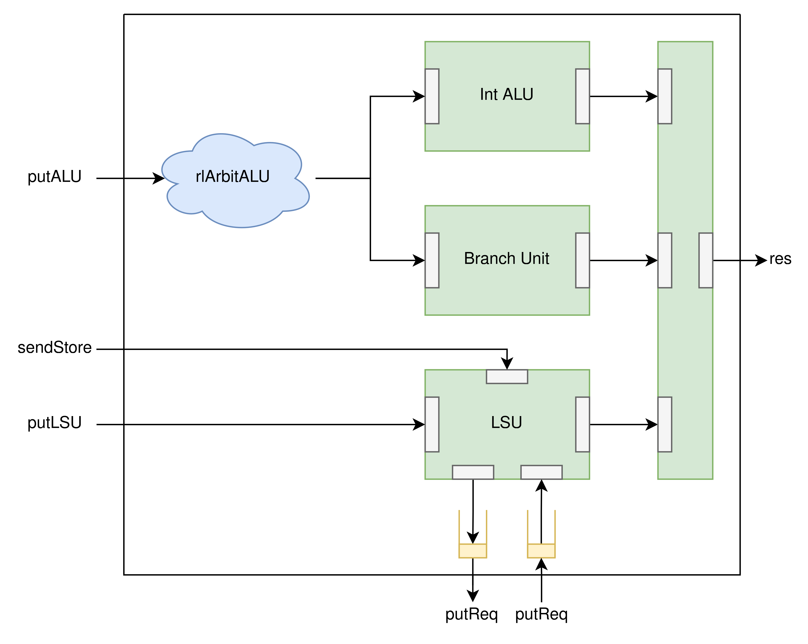
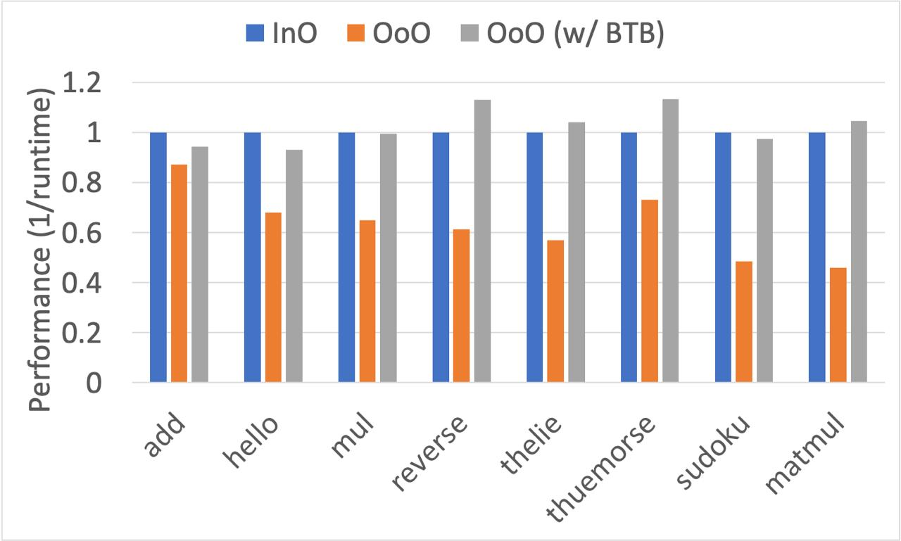
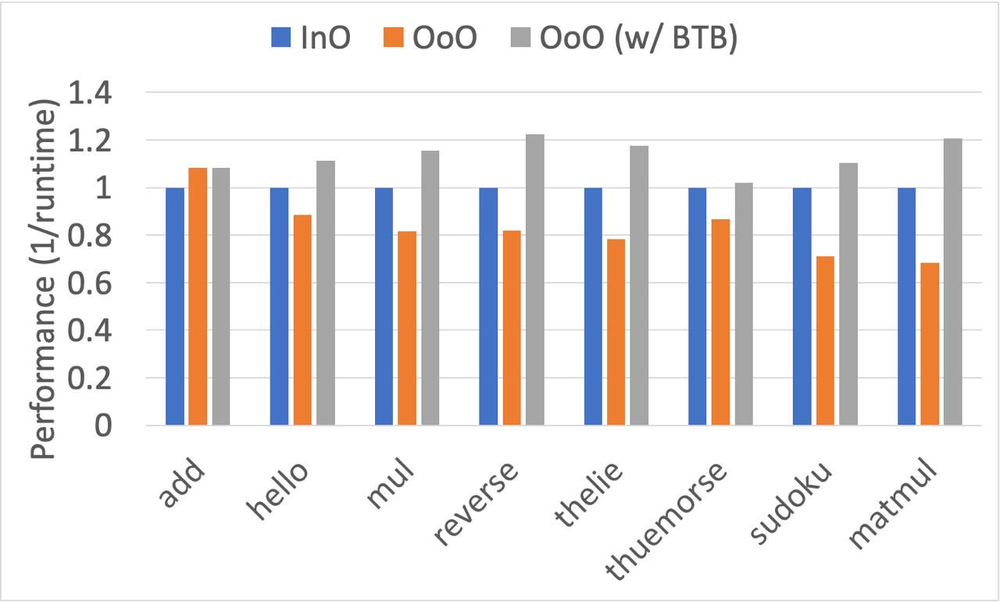
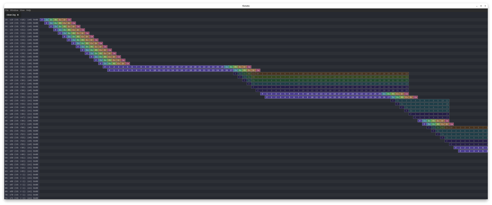

# ECOOM
EPFL Constructive Out-Of-Order Machine (ECOOM) is a configurable Risc-V RV32I machine. This machine is designed for [Constructive Computer Architecture](https://edu.epfl.ch/coursebook/en/constructive-computer-architecture-CS-629) course given in 2024 spring in [EPFL](https://www.epfl.ch/en/). The implementation of the core is done using [Bluespec System Verilog](https://bluespec.com). The general architecture of the core is shown below in the figure. 

The core consists of 8 stages.The stages are `Fetch1`, `Fetch2` (optional), `Issue`, `Dispatch`, `Execute`, `Complete` and `Commit`. The details of each stages will be explained on the next sections. Along with the core, there are also configurable caches in the system. These caches can be configurable in their sizes, ways and replacement policy.

# Architecture
Architecture of the core is divided between two main modules, `frontend` and `backend`. `Core.bsv` file contains the connection between these top modules along with the commit stage. Commit stage is responsible for the commiting of the instruction that is in the top of the Reorder Buffer. The stage contains an architectural Register map and Free list. On a commit, these stages are modified to reflect the architectural state, they are also used for rewinding on a misprediction.

## Frontend
The frontend module of ECOOM, includes the fetch, issue and dispatch stages. Fetch stage is responsible for bringing the instruction from the cache and branch prediction. Issue stage does the register renaming and placement to reorder buffer. Dispatch stage first reads the registers from the register file then places them to the reservation station, and dispatches upto two ready instructions.

### Fetch
Fetch stage includes a configurable size, directly mapped, branch target buffer for predicting the next address. After sending a request to the cache to the address in PC, the values of epoch, PC and predicted PC are send to the inflight operations FIFO. This FIFO is used for checking the request epoch against the current epoch for the validity of the response. If the epochs do not match, the response is dropped, otherwise sent to the issue stage. On a misprediction redirection jump, the information about the jump (origin pc, target pc) is used for steering the PC and toggling the epoch.

### Issue
Issue stage takes an instruction from the fetch stage and maps its registers from architectural to physical registers then puts them to the reorder buffer. Register rename is done by a register map for the architectural to physical register mapping and using a free list for selecting an available register for the destination register. After the mapping is done this instruction is placed to the reorder buffer and also sent to the dispatch unit.

When an instruction is completed it is placed to the reorder buffer to be commited later on. If an instruction is at the head of the reorder buffer and alsi completed, it is pushed out of the drain port to the commit stage. Commit stage graduates a register so that it can be used on a future instruction.

### Dispatch
Dispatch stage does register reading then puts them to the reservation stations. Readiness of the source registers of the instruction is checked from the RDYB bitmap, and at the same time the source registers are read. Then this two information is combined to show the data and validity, then they are placed to the correct reservation station. Memory instructions are placed to an inorder reservation station, meanwhile the other operations are placed to an out of otder reservation station.

The inorder reservation station behaves like a queue for inputs and outputs, while also supports random access for the placement of the result of a completed instruction. Only an instruction that has both of its operands ready, and also in the head of the queue, can be dispatch from this unit.

## Backend
The backend or to be more precise, execute stage of ECOOM, is responsible of arbitration of instructions to the correct units and results to the register file. Although an instruction from putLSU port will definetly go to the LSU, other instructions might choose from ALU or BU. Also since multiple instructions complete at the same time, arbitration of these results must be done to ensure one instruction completion constraint of our core (due to the register file having only one port).

Load Store Unit requires a sendStore signal from the commit stage to commit its store instruction. Since this unit behaves completely in order between its instructions, a store must block later operations due to two main reason. Easier to solve issue of a later load addressing the store operation inflight, and harder to solve issue of a later store instruction happening before a previous jump instruction is completed, therefore a speculative store happening.

# Performance Results
Performance results of our core is shown on the following figures. The first figure shows the performance in a cache with one cycle latency and the later figure showing the system on a cache with two cycle latency (not pipelined). It can be seen that an out of order machine with no branch prediction shows very poor performance agains an in order core, it is as low as 50% of the performance. But even with a very basic BTB, the performance jumps to the same 
or up to 20% faster than in order. The core shows much better performance when the instruction input throughput is lower, since it can execute instructions even though the LSU is completely blocked. 

Following snapshot from konata shows the performance of the core along with the penalty of a branch instruction.

